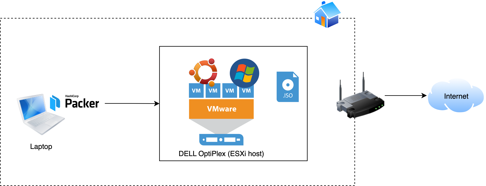
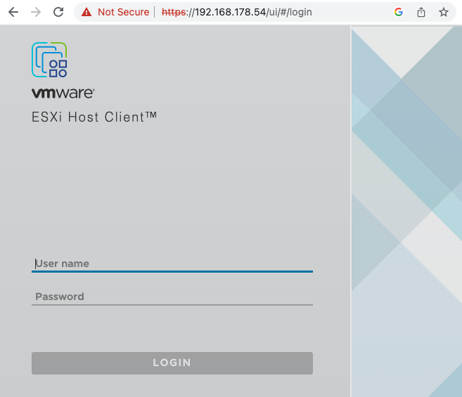
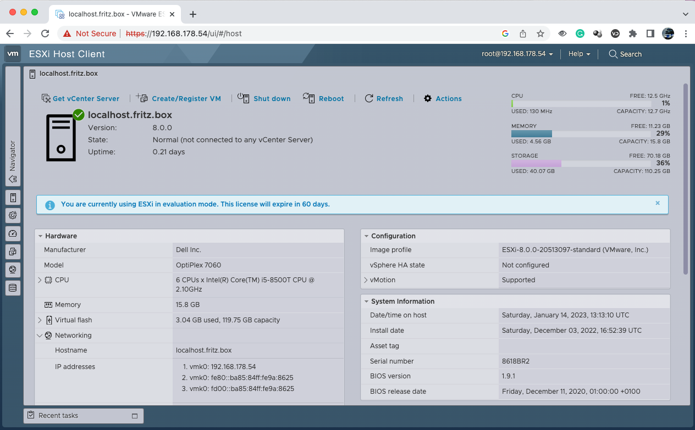
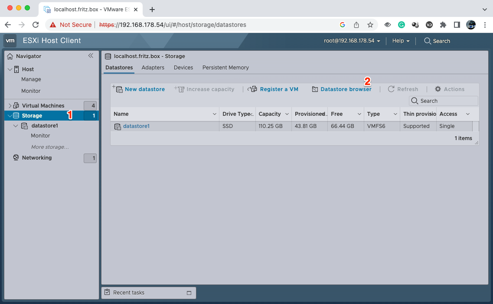
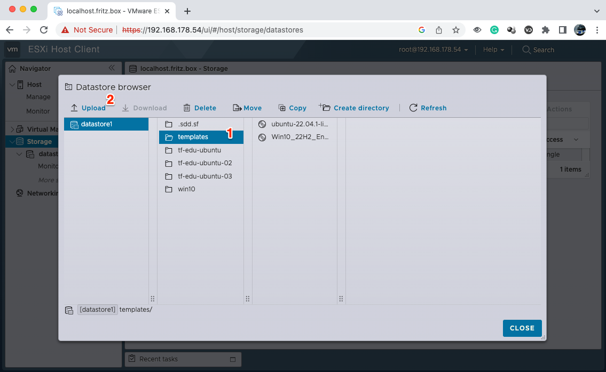

# Provision Ubuntu VM on a local vSphere ESXi host



## Hardware prerequisites
1. Spare x86 host like an old laptop, PC etc.
1. USB Stick with min 8 GB capacity

## Installation steps

### Installation of vSphere
* Get vSphere 8 for free for 60 days ([link](https://customerconnect.vmware.com/en/evalcenter?p=vsphere-eval-8))
* Create a bootable USB Stick with [Rufus](https://rufus.ie/en/) (Windows) or [Etcher](https://www.balena.io/etcher/)(Mac)
* Adjust your boot settings in BIOS on your target host (spare laptop, PC etc.), boot with the vSphere image and run through the installation

After you ESXi host is running you can open the vSphere console by navigating to the IP on any device in your local network.

After a successful login you will be welcomed with the vSphere management home screen


### Preparation of the Ubuntu ISO image
* Download Ubuntu ISO [here](https://ubuntu.com/download/server#downloads)
* Navigate to your datastore in vSphere and upload the ISO to a folder of your choice



Now adjust the variables in [vars.auto.pkrvars.hcl](./vars.auto.pkrvars.hcl) based on your environment parameters

## Deploy a VM
```
packer build -var 'vm_name=tf-edu-ubuntu' -var 'host_name=ubuntu4' -var 'vm_cpus=1' -var 'vm_ram=1024' -var 'vm_disk_size=6144' .
```

